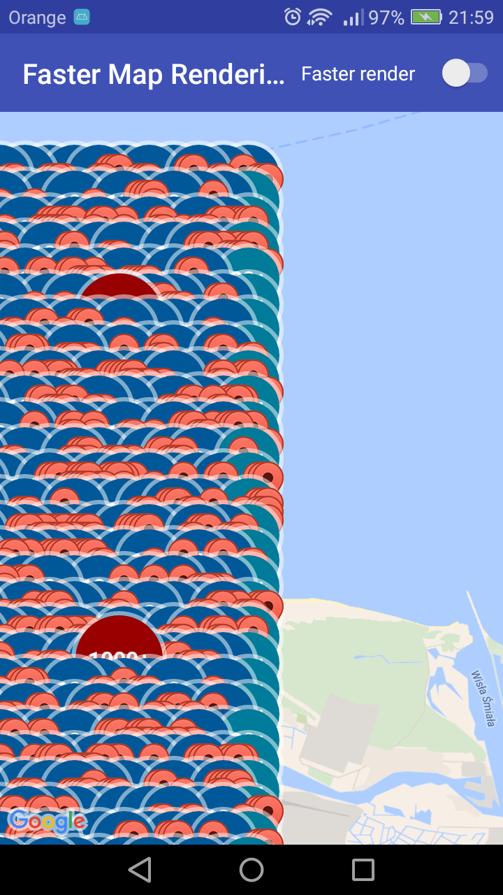

# Google Maps Util for Android

## Introduction

This is library for everyone who wants to show many markers on screen. You must only set a value for variable mManyMarkers.
If you want to show only markers on screen and have faster rendering you should set it to 'true'.
When you want to use normal lib, you should set it to false. But be carefull, all markers will be rendered and it will be very slowly.

## Used libs

It used [Android Maps Utils API](https://github.com/bobzilladev/android-maps-utils) and [Google Maps Android
API](http://developer.android.com/google/play-services/maps.html).

## HOW IT WORKS
As you can see in app, when you try to show more than 500 markers on small area and use normal lib, it takes almost one minute to finish rendering
and looks like on the image below (there is 10 000 markers).

With deleting rendering outside the screen it takes only few seconds.

## Comments

Do not change switch while markers are rendering. If you do that, old markers may stay on screen.
(it is only example and I don't want to waste time for fix it).

Remember change Google API key for yours in keys.xml file!